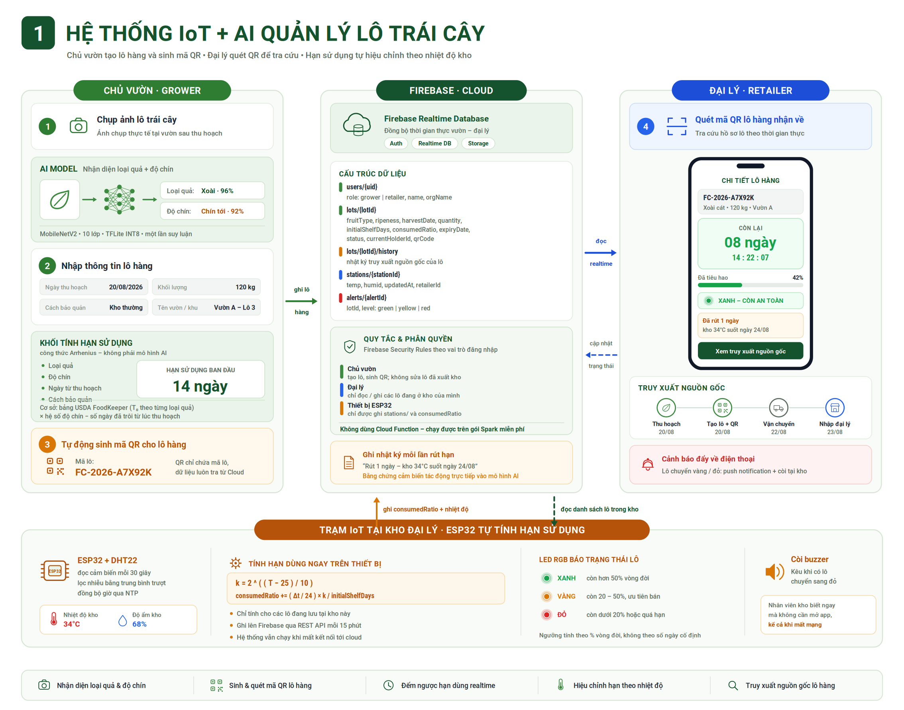

# FruitTrace

Hệ thống quản lý và truy xuất lô trái cây từ vườn đến đại lý.
Đồ án môn Phát triển ứng dụng di động — Trường Đại học Công nghệ Kỹ thuật TP.HCM.

Ứng dụng React Native + trạm IoT ESP32 + Firebase Realtime Database, kèm mô hình
nhận diện trái cây chạy trực tiếp trên điện thoại.

---

## Điểm cốt lõi

Khác với cách in hạn dùng cố định lên bao bì, hệ thống này **tính hạn sử dụng động
theo nhiệt độ bảo quản thực tế**. Cảm biến DHT22 tại kho đại lý đo nhiệt độ, và
nhiệt độ đó trực tiếp làm thay đổi tốc độ tiêu hao vòng đời của lô hàng theo công
thức Arrhenius:

```
k = 2 ^ ( ( T − 25 ) / 10 )                          Q10 = 2, mốc chuẩn 25°C
consumedRatio += ( Δt / 24 ) × k / initialShelfDays
lô hết hạn khi consumedRatio ≥ 1.0
```

Kho nóng hơn thì trái cây hỏng nhanh hơn, và con số đếm ngược trên app phản ánh
đúng điều đó. Đây là lý do hệ thống bắt buộc phải có cảm biến thật.

---

## Hai vai trò

| Vai trò | Chức năng |
|---|---|
| **Chủ vườn** | Chụp ảnh lô hàng, AI nhận diện loại quả và độ chín, nhập thông tin lô, hệ thống tính hạn sử dụng, sinh mã QR dán lên thùng, xuất kho giao vận chuyển |
| **Đại lý** | Quét QR nhận lô, xem hồ sơ và đếm ngược thời gian thực, theo dõi kho theo màu trạng thái, nhận cảnh báo, truy xuất nguồn gốc, đánh dấu đã bán |

Vòng đời một lô: `at_garden → in_transit → in_stock → sold`

---

## Ảnh chụp màn hình

<!-- Chèn 3-4 ảnh chụp thật vào docs/screenshots/ rồi thay đường dẫn dưới -->

| Chủ vườn | Đại lý |
|---|---|
|  |  |

---

## Kiến trúc



| Thành phần | Công nghệ |
|---|---|
| Ứng dụng | React Native, Expo SDK 57, TypeScript, Expo Router |
| Backend | Firebase Realtime Database, Firebase Auth |
| Camera & QR | expo-camera (CameraView) |
| AI on-device | react-native-fast-tflite, MobileNetV2 INT8 |
| Vi điều khiển | ESP32 DevKit V1, Arduino |
| Cảm biến | DHT22, LED RGB KY-016, buzzer KY-012 |

Ba nguyên tắc thiết kế:

- **AI chạy trên điện thoại**, không chạy trên ESP32 — vi điều khiển không có
  camera và không đủ RAM cho mạng nơ-ron.
- **ESP32 tự tính `consumedRatio`**, không dùng Cloud Function, nên hệ thống chạy
  được trên gói Firebase Spark miễn phí.
- **Mã QR chỉ chứa mã lô**, không nhúng dữ liệu — vì hạn dùng thay đổi theo thời
  gian, nhúng cứng sẽ cho số sai sau vài ngày.

---

## Mô hình AI

MobileNetV2 transfer learning, 10 lớp, lượng tử hóa INT8 để chạy on-device.

```
Chuoi_chin_ky   Chuoi_chin_toi   Chuoi_hong   Chuoi_xanh
Dau             Nho              Tao
Xoai_chin_toi   Xoai_hong        Xoai_xanh
```

| Chỉ số | Giá trị |
|---|---|
| Test accuracy (float32) | 95,71 % |
| Test accuracy (INT8) | 95,94 % |
| Top-2 accuracy | 99,65 % |
| Macro F1 | 0,9598 |
| Cohen's kappa | 0,9514 |
| Kích thước model | 8,92 MB → **2,72 MB** (nén 3,3×) |
| Độ trễ suy luận trên điện thoại | 30 – 95 ms |

Bộ dữ liệu `dataset_final_v2`: 11.309 ảnh, tập huấn luyện 7.914 ảnh, ghép từ ba
nguồn Kaggle qua quy trình làm sạch ba tầng (lọc tự động → duyệt thủ công → CLIP
zero-shot). Chi tiết trong [`docs/preprocessing_chapter.md`](docs/preprocessing_chapter.md).

**Giới hạn đã đo được:** con số 95,71 % tính trên tập test cùng phân phối với tập
huấn luyện. Trên ảnh chụp thật bằng điện thoại, độ chính xác giảm đáng kể do
domain gap — ảnh trong dataset chụp studio nền sáng, ảnh thực tế tối hơn nhiều.
Ứng dụng xử lý bằng ngưỡng tin cậy 0,70 và cho phép người dùng chọn thủ công.

---

## Cấu trúc mã nguồn

```
app/                    màn hình, điều hướng theo Expo Router
├── (auth)/             đăng nhập, đăng ký
├── (grower)/           luồng chủ vườn
├── (retailer)/         luồng đại lý
└── lot/                chi tiết, sửa, danh sách lô

src/
├── services/           nơi duy nhất chạm vào Firebase SDK
├── hooks/              bọc service, quản lý vòng đời subscribe
├── lib/                logic nghiệp vụ thuần, có unit test
├── components/         thành phần giao diện dùng lại
├── mocks/              dữ liệu giả cho chế độ USE_MOCK
└── constants/          bảng màu, chuỗi tiếng Việt

hardware/               firmware ESP32
docs/                   tài liệu, infographic, kết quả AI, tiến độ
```

85 tệp TypeScript, 6 tệp unit test bao phủ toàn bộ logic nghiệp vụ cốt lõi.

---

## Chạy dự án

### Cần xin riêng (không có trong repo)

| Thứ cần | Vì sao thiếu |
|---|---|
| Tệp `.env` | Bị gitignore để tránh lộ khoá Firebase |
| File APK development | Không nằm trong repo, tải từ EAS |
| Quyền vào Firebase Console | Chủ project mời qua Users and permissions |

### Các bước

```bash
git clone https://github.com/Turnippii/Fruit-Batch-Management-System.git
cd Fruit-Batch-Management-System

npm install --legacy-peer-deps

# chép tệp .env xin được vào thư mục gốc

npx expo start
```

> **Bắt buộc dùng `--legacy-peer-deps`** do xung đột peer dependency giữa
> `expo-router` và `react`. Với `expo install` thì cú pháp là
> `npx expo install <pkg> -- --legacy-peer-deps`

Cài file APK development lên điện thoại Android, mở app, bấm **Scan QR Code**,
quét mã hiện trong terminal. Điện thoại và máy tính phải cùng một mạng Wi-Fi.

**Không chạy được bằng Expo Go** — camera, quét QR và TFLite đều là native module.

### Tài khoản thử

| Vai trò | Email | Mật khẩu |
|---|---|---|
| Chủ vườn | vuon@test.com | 123456 |
| Đại lý | daily@test.com | 123456 |

### Chế độ dự phòng

Trong `src/config.ts` có cờ `USE_MOCK`. Bật lên là toàn bộ ứng dụng chạy bằng dữ
liệu giả, không gọi Firebase lần nào, kể cả phần nhận diện AI. Dùng khi mạng hỏng
hoặc khi cần demo mà không có kết nối.

---

## Kiểm thử

```bash
npx tsc --noEmit      # kiểm tra kiểu
npx jest              # unit test
```

Unit test tập trung vào logic nghiệp vụ trong `src/lib/`:

| Tệp | Nội dung kiểm thử |
|---|---|
| `shelfLife.test.ts` | Công thức Q10, tính tiêu hao theo từng chặng, ba nhánh của `resolveConsumedRatio` |
| `lotStatus.test.ts` | Ràng buộc chuyển trạng thái theo vai trò |
| `lotCode.test.ts` | Sinh và kiểm tra định dạng mã lô |
| `demoLots.test.ts` | Tính ngược ngày thu hoạch từ ngưỡng màu |
| `lotHolder.test.ts` | Phân giải vai trò theo trạng thái lô |
| `base64.test.ts` | Bộ giải mã base64 cho pipeline ảnh |

---

## Build

```bash
# bản development, cần Metro, để phát triển
eas build --profile development --platform android

# bản độc lập, không cần Metro, để demo
eas build --profile preview --platform android
```

Chỉ phải build lại khi thêm thư viện native, đổi icon/splash, hoặc đổi package
name. Sửa giao diện và logic JavaScript thì Metro tự nạp lại.

---

## Tiến độ

Xem [`docs/tien-do/`](docs/tien-do/) — bảng Gantt và slide báo cáo từng tuần.

| Hạng mục | Tình trạng |
|---|---|
| Dataset và tiền xử lý | Hoàn tất |
| Huấn luyện và đánh giá model | Hoàn tất |
| Ứng dụng: 8 màn hình hai vai trò | Hoàn tất |
| Firebase, phân quyền, Security Rules | Hoàn tất |
| Camera, quét QR, sinh QR | Hoàn tất |
| Tích hợp TFLite on-device | Hoàn tất |
| Chế độ demo, nén thời gian | Hoàn tất |
| Lắp ráp phần cứng ESP32 | Hoàn tất |
| Kết nối ESP32 với Firebase | Đang làm |
| Tập ảnh tự chụp đo domain gap | Chưa làm |
| Thực nghiệm hệ số độ chín | Chưa làm |

---

## Phân công

| Thành viên | Mảng phụ trách |
|---|---|
| *(điền tên)* | Luồng chủ vườn, kiến trúc app |
| *(điền tên)* | Luồng đại lý, quét QR |
| *(điền tên)* | Phần cứng ESP32, Firebase |
| *(điền tên)* | AI và dữ liệu |

---

## Tài liệu

- [`docs/FRUITTRACE_TAI_LIEU_TONG_HOP.docx`](docs/) — tài liệu tổng hợp đề tài,
  chi tiết phần kết nối ESP32 ↔ Firebase ↔ App
- [`docs/HUONG_DAN_TRIEN_KHAI.docx`](docs/) — hướng dẫn lắp ráp và lập trình phần cứng
- [`CLAUDE.md`](CLAUDE.md) — bối cảnh kỹ thuật, quy tắc nghiệp vụ, các quyết định
  kiến trúc đã chốt
- [`database.rules.json`](database.rules.json) — Security Rules của Realtime Database